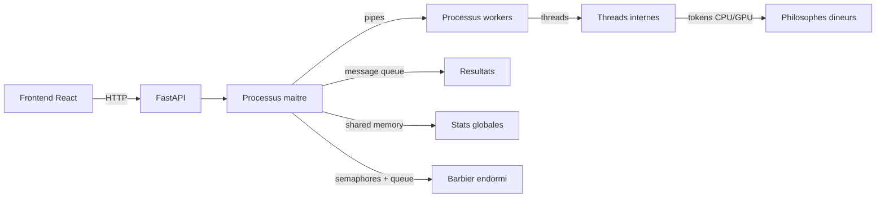
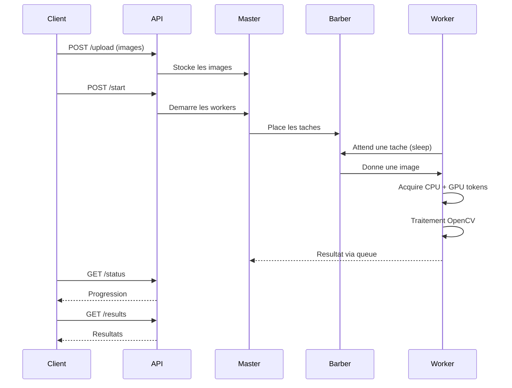

# Diagrammes

## Diagramme d architecture

```mermaid
flowchart LR
  UI[Frontend React] -->|HTTP| API[FastAPI]
  API --> Master[Processus maitre]
  Master -->|pipes| Workers[Processus workers]
  Master -->|message queue| Results[Resultats]
  Master -->|shared memory| Stats[Stats globales]
  Master -->|semaphores + queue| Barber[Barbier endormi]
  Workers -->|threads| Threads[Threads internes]
  Threads -->|tokens CPU/GPU| Tokens[Philosophes dineurs]
```

## Diagramme de sequence

```mermaid
sequenceDiagram
  participant Client
  participant API
  participant Master
  participant Barber
  participant Worker

  Client->>API: POST /upload (images)
  API->>Master: Stocke les images
  Client->>API: POST /start
  API->>Master: Demarre les workers
  Master->>Barber: Place les taches
  Worker->>Barber: Attend une tache (sleep)
  Barber->>Worker: Donne une image
  Worker->>Worker: Acquire CPU + GPU tokens
  Worker->>Worker: Traitement OpenCV
  Worker-->>Master: Resultat via queue
  Client->>API: GET /status
  API-->>Client: Progression
  Client->>API: GET /results
  API-->>Client: Resultats
```
